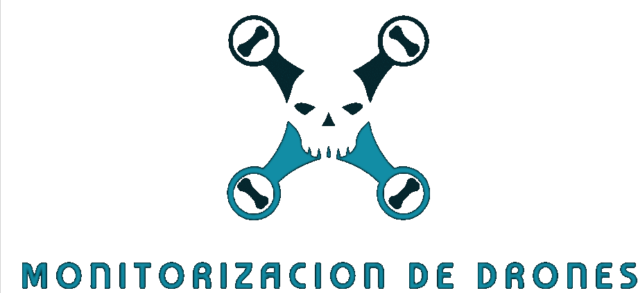
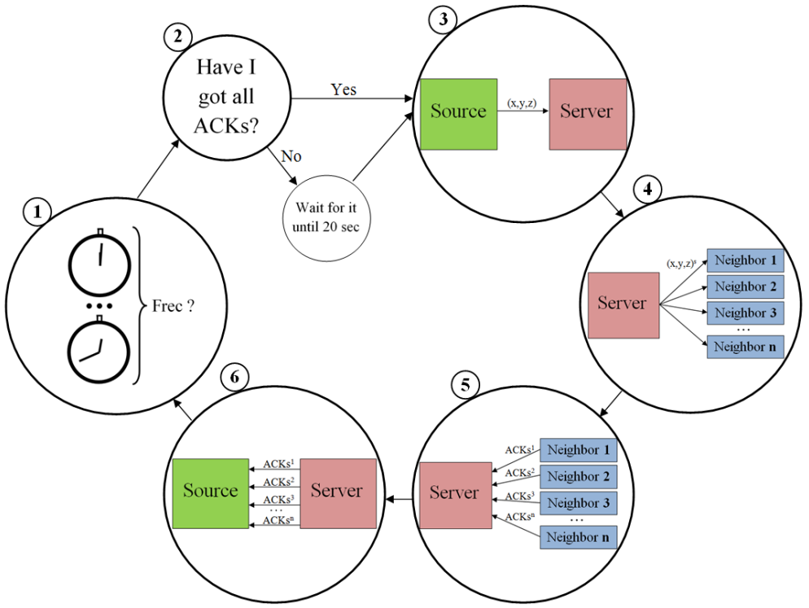

<a id="readme-top"></a>

<!-- PROJECT SHIELDS -->
[![Contributors][contributors-shield]][contributors-url]
[![Forks][forks-shield]][forks-url]
[![Stargazers][stars-shield]][stars-url]
[![Issues][issues-shield]][issues-url]
[![MIT License][license-shield]][license-url]
[![LinkedIn][linkedin-shield]][linkedin-url]

<!-- PROJECT LOGO -->
<br />
<div align="center">
  <a href="https://github.com/vectorete/server-multiclient-drones">
    
  </a>

<h3 align="center">Drone Monitoring System</h3>

  <p align="center">
    Client-server architecture drone monitoring system to manage and simulate configurable drone operations.
    <br />
    <a href="https://github.com/vectorete/server-multiclient-drones"><strong>Explore the docs »</strong></a>
    <br />
    <br />
    <a href="https://github.com/vectorete/server-multiclient-drones">View Demo</a>
    ·
    <a href="https://github.com/vectorete/server-multiclient-drones/issues/new?labels=bug&template=bug-report---.md">Report Bug</a>
    ·
    <a href="https://github.com/vectorete/server-multiclient-drones/issues/new?labels=enhancement&template=feature-request---.md">Request Feature</a>
  </p>
</div>

<!-- TABLE OF CONTENTS -->
<details>
  <summary>Table of Contents</summary>
  <ol>
    <li>
      <a href="#about-the-project">🔎 About The Project</a>
      <ul>
        <li><a href="#features">✨ Features</a></li>
        <li><a href="#built-with">🔨 Built With</a></li>
        <li><a href="#project-phases">➡️ Project Phases</a></li>
      </ul>
    </li>
    <li>
      <a href="#getting-started">🚀 Getting Started</a>
      <ul>
        <li><a href="#prerequisites">📝 Prerequisites</a></li>
        <li>
          <a href="#installation">📥 Installation</a>
          <ul>
            <li><a href="#no-interface-setup"></> Setup without the interface</a></li>
            <li><a href="#interface-setup">🖼️ Server and Client Setup with the interface (using NetBeans IDE)</a></li>
          </ul>
        </li>
      </ul>
    </li>
    <li>
      <a href="#usage">🧩 Usage</a>
      <ul>
        <li><a href="#testing-locally">🧪 Testing Locally</a></li>
        <li>
          <a href="#demos">📽️ Demos</a>
          <ul>
            <li><a href="#demo1">🥇 Demo with 60,000 clients</a></li>
            <li><a href="#demo2">🥈 Demo showcasing the interface</a></li>
          </ul>
        </li>
      </ul>
    </li>
    <li><a href="#contributing">🤝 Contributing</a></li>
    <li><a href="#license">©️ License</a></li>
    <li><a href="#contact">☎️ Contact</a></li>
  </ol>
</details>

<!-- ABOUT THE PROJECT -->
## 🔎 About The Project <a id="about-the-project"></a>

<div align="center">
  <a href="https://github.com/vectorete/server-multiclient-drones">
    
  </a>
</div>

The Drone Monitoring System is a project that recreates a drone monitoring system, using a client-server architecture. The server manages multiple drone clients, processing their position, and forwarding their position data to other drones. The system does not prevent collisions but efficiently manages a large number of clients for testing purposes.

#### ➡️ Project Phases <a id="project-phases"></a>

Since clients and the server can be on different machines, the simulation of the CAR communication system will be carried out in three phases:

1. **Initiation Phase**:
    - First, the server will start and ask the user for the values of the parameters N, V, and S.
    - Next, it will wait for the N clients to appear and connect to it.
    - The server will assign each new client an identifier and a group identifier (since V is a divisor of N, the client identifier is sufficient to know which group it belongs to).
    - The client will receive its identifier and wait for the start signal of the simulation.

2. **Simulation Phase**:
    - Once all clients have connected to the system, the server will send a signal to all of them to start the simulation.
    - From that moment on, each client executes the cycle indicated in the diagram asynchronously with the other clients. This cycle will be executed S times. At the end of each cycle, the client updates the average time it took to complete the cycle.

3. **Calculation Phase**:
    - When each client finishes its S iterations of the cycle, it sends the updated average response time of the S cycles to the server and then disconnects from the system.
    - When all clients have finished and sent their averages, the server calculates the average response time for each group and the overall system response time for that simulation. These are the results that each simulation should provide.

<p align="right">(<a href="#readme-top">back to top</a>)</p>

### ✨ Features <a id="features"></a>

- **Client-Server Architecture**: Uses TCP sockets to establish communication between drones (clients) and the server.
- **Client Simulation**: Clients send position data to the server, which then forwards this data to other clients.
- **Concurrency**: The server handles multiple clients concurrently using threads.
- **Performance Testing**: Designed to simulate a high volume of clients to test server performance.

<p align="right">(<a href="#readme-top">back to top</a>)</p>

### 🔨 Built With <a id="built-with"></a>
* [![Java][Java]][Java-url]

<p align="right">(<a href="#readme-top">back to top</a>)</p>

<!-- GETTING STARTED -->
## 🚀 Getting Started <a id="getting-started"></a>

To get a local copy up and running follow these simple steps.

### 📝 Prerequisites <a id="prerequisites"></a>

* Java Development Kit (JDK): Ensure you have JDK 8 or higher installed.
> [!IMPORTANT]
> JDK 21 if you will use the interface.

* Network Configuration: Ensure your network allows communication on the specified ports.
* Integrated Development Environment (IDE): NetBeans is recommended, but you can use any IDE that supports Java.

> [!IMPORTANT]
>  If you want to make use of the interface is a must.


### 📥 Installation <a id="installation"></a>

#### </> Setup without the interface <a id="no-interface-setup"></a>

> [!NOTE]
> You don't need the folder with the project of the client interface

1. **Compile the server code**:
    ```java
    javac Servidor.java
    ```
    
2. **Run the server**:
    ```java
    java Servidor.java
    ```
    
3. **Introduce at the server your desired parameters in the input**

4. **Edit the clients code variables to match with the server parameters**
   
5. **Compile the client code**:
    ```java
    javac Clientes.java
    ```
    
6. **Run the clients**:
    ```java
    java Clientes.java
    ```

<p align="right">(<a href="#readme-top">back to top</a>)</p>

#### 🖼️ Server and Client Setup with the interface (using NetBeans IDE) <a id="interface-setup"></a>

1. **Clone the repository**:
    ```java
    git clone https://github.com/vectorete/server-multiclient-drones.git
    ```

2. **Open the project in NetBeans**:
    * Open NetBeans and navigate to `File > Open Project`.
    * Select the cloned repository folder.

3. **Build the project**:
    * Right-click on the project in the `Projects` pane and select `Clean and Build`.

4. **Configure the number of clients on the individual files**:
    * Edit `Clientes.java` and set the number of clients to one less than the number in `Servidor.java` to account for the interface client, and the rest of the parameters as you desire.

5. **Compile and run the server as before**:
    * Open `Servidor.java` and set the number of clients, the size of groups, and the number of iterations in the input.

6. **Compile an run the clients as before**:
    * The last client will act as the interface to visualize the coordinates of each drone in its group.

7. **Run the interface**

<p align="right">(<a href="#readme-top">back to top</a>)</p>

<!-- USAGE EXAMPLES -->
## 🧩 Usage <a id="usage"></a>

### 🧪 Testing Locally <a id="testing-locally"></a>

When testing locally, be aware of the following:

- **Port Limits on Windows**: Windows may lock up to 16,384 ports for dynamic use. To test with more clients than this limit, you have two options:
  1. **Use Multiple PCs**: Distribute the clients across multiple machines to avoid hitting the port limit.
  2. **Change Port Limits**: Use the following command to view and adjust the dynamic port range on Windows:
     ```java
     netsh int ipv4 show dynamicportrange tcp
     ```
     To change the dynamic port range, use:
     ```java
     netsh int ipv4 set dynamicportrange tcp start=xxxxx num=yyyyy
     ```
     Replace `xxxxx` with the starting port number and `yyyyy` with the number of ports.
     
<p align="right">(<a href="#readme-top">back to top</a>)</p>

### 📽️ Demos <a id="demos"></a>

#### 🥇 Demo with 60,000 clients <a id="demo1"></a>
[](https://www.youtube.com/watch?v=ryzMgj_m2p8)

#### 🥈 Demo showcasing the interface <a id="demo2"></a>
[](https://www.youtube.com/watch?v=8YvBKZ6ilX4)

_For more examples, please refer to the [Documentation](https://example.com)_

<p align="right">(<a href="#readme-top">back to top</a>)</p>

<!-- CONTRIBUTING -->
## 🤝 Contributing <a id="contributing"></a>

Contributions are what make the open source community such an amazing place to learn, inspire, and create. Any contributions you make are **greatly appreciated**.

If you have a suggestion that would make this better, please fork the repo and create a pull request. You can also simply open an issue with the tag "enhancement". Don't forget to give the project a star! Thanks again!

1. Fork the Project
2. Create your Feature Branch (`git checkout -b feature/AmazingFeature`)
3. Commit your Changes (`git commit -m 'Add some AmazingFeature'`)
4. Push to the Branch (`git push origin feature/AmazingFeature`)
5. Open a Pull Request

<p align="right">(<a href="#readme-top">back to top</a>)</p>

<!-- LICENSE -->
## ©️ License <a id="license"></a>

Distributed under the MIT License. See `LICENSE.txt` for more information.

<p align="right">(<a href="#readme-top">back to top</a>)</p>

<!-- CONTACT -->
## ☎️ Contact <a id="contact"></a>

Victor Kravchuk Vorkevych - victorkravchuk19@gmail.com

Project Link: [https://github.com/vectorete/server-multiclient-drones](https://github.com/vectorete/server-multiclient-drones)

<p align="right">(<a href="#readme-top">back to top</a>)</p>

<!-- MARKDOWN LINKS & IMAGES -->
<!-- https://www.markdownguide.org/basic-syntax/#reference-style-links -->
[contributors-shield]: https://img.shields.io/github/contributors/vectorete/server-multiclient-drones.svg?style=for-the-badge
[contributors-url]: https://github.com/vectorete/server-multiclient-drones/graphs/contributors
[forks-shield]: https://img.shields.io/github/forks/vectorete/server-multiclient-drones.svg?style=for-the-badge
[forks-url]: https://github.com/vectorete/server-multiclient-drones/network/members
[stars-shield]: https://img.shields.io/github/stars/vectorete/server-multiclient-drones.svg?style=for-the-badge
[stars-url]: https://github.com/vectorete/server-multiclient-drones/stargazers
[issues-shield]: https://img.shields.io/github/issues/vectorete/server-multiclient-drones.svg?style=for-the-badge
[issues-url]: https://github.com/vectorete/server-multiclient-drones/issues
[license-shield]: https://img.shields.io/github/license/vectorete/server-multiclient-drones.svg?style=for-the-badge
[license-url]: https://github.com/vectorete/server-multiclient-drones/blob/master/LICENSE.txt
[linkedin-shield]: https://img.shields.io/badge/-LinkedIn-black.svg?style=for-the-badge&logo=linkedin&colorB=555
[linkedin-url]: https://linkedin.com/in/vectorete
[product-project]: images/projectimg.png
[Java]:	https://img.shields.io/badge/Java-ED8B00?style=for-the-badge&logo=openjdk&logoColor=white
[Java-url]: https://java.com
